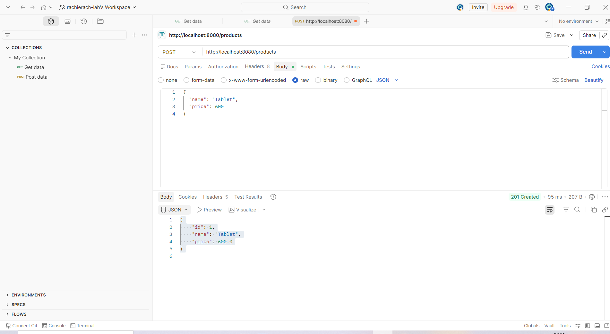
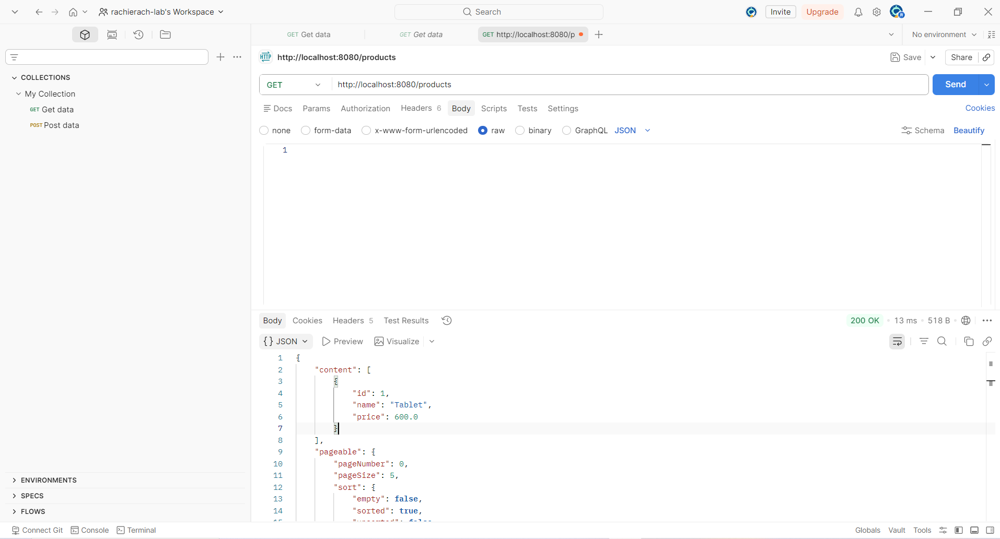
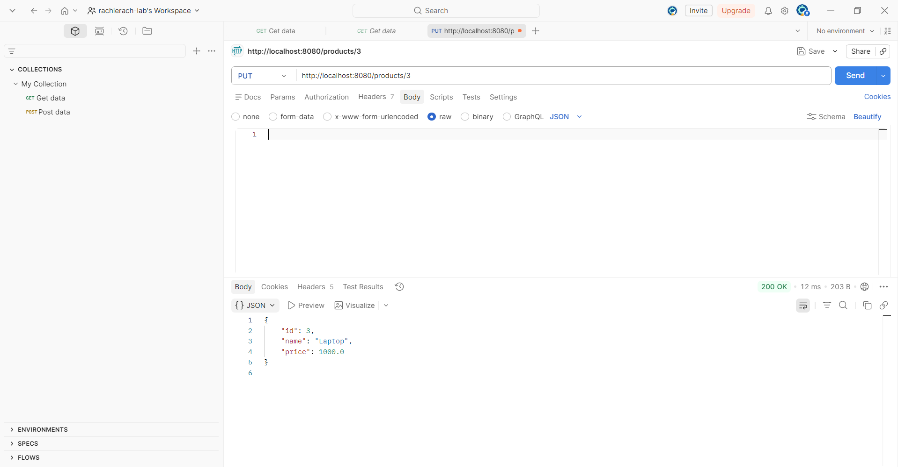
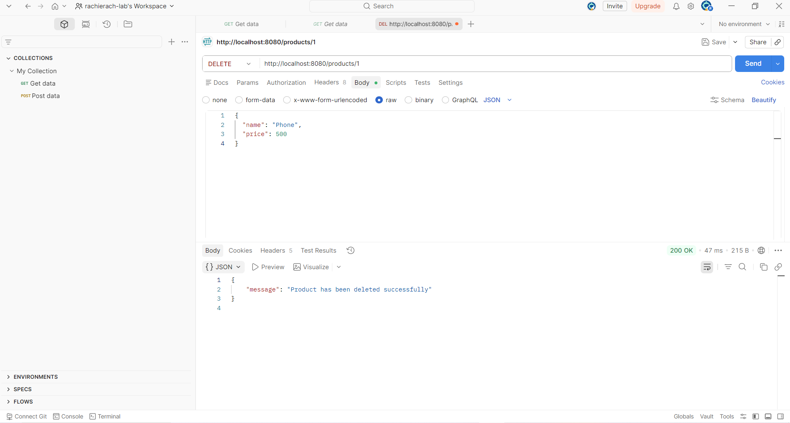
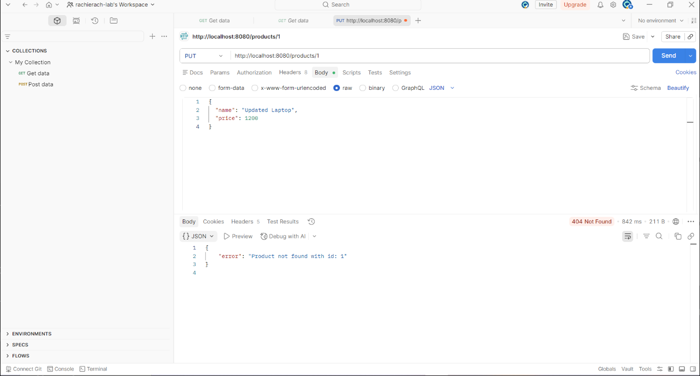
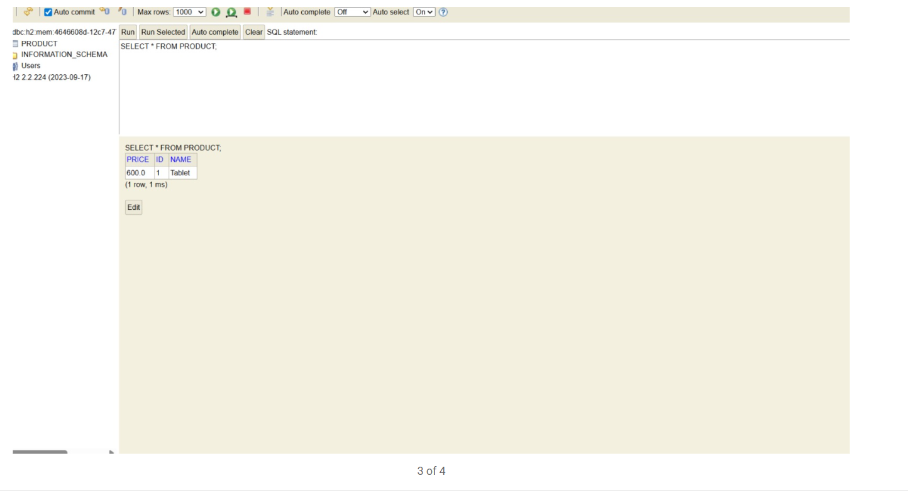

# First REST API – Spring Boot Product Management

A REST API built with **Spring Boot 3.3.5** and **Java 17** that manages products using a layered architecture and an in-memory **H2** database.

---

## Tech Stack

- Java 17, Spring Boot 3.3.5
- Spring Web, Spring Data JPA, H2 Database
- Spring Boot Validation, DevTools
- Maven

---

## How to Run

```bash
./mvnw spring-boot:run
```

App starts at `http://localhost:8080`

---

## API Endpoints

| Method | URL | Description |
|---|---|---|
| `POST` | `/products` | Create a product |
| `GET` | `/products` | Get all products |
| `GET` | `/products/{id}` | Get product by ID |
| `PUT` | `/products/{id}` | Update a product |
| `DELETE` | `/products/{id}` | Delete a product |

---

## Use Cases

### 1. Create a Product (POST)

```
POST http://localhost:8080/products
{ "name": "Tablet", "price": 600 }
```
Response: `201 Created` – returns the saved product with auto-generated `id`.



---

### 2. Get All Products (GET)

```
GET http://localhost:8080/products
```
Response: `200 OK` – paginated list of all products.



---

### 3. Update a Product (PUT)

```
PUT http://localhost:8080/products/3
{ "name": "Laptop", "price": 1000 }
```
Response: `200 OK` – returns the updated product.



---

### 4. Delete a Product (DELETE)

```
DELETE http://localhost:8080/products/1
```
Response: `200 OK` – `{ "message": "Product has been deleted successfully" }`



---

### 5. Error – Product Not Found (404)

If the requested `id` does not exist, a structured error is returned instead of a generic 500.

```
PUT http://localhost:8080/products/1
→ { "error": "Product not found with id: 1" }
```



---

## H2 Database Console

1. Go to `http://localhost:8080/h2-console`
2. Set JDBC URL to `jdbc:h2:mem:testdb`, username `sa`, no password
3. Click Connect and run `SELECT * FROM PRODUCT;`



---

## Exception Handling

`GlobalExceptionHandler` (`@ControllerAdvice`) handles:
- `ProductNotFoundException` → `404 Not Found`
- `MethodArgumentNotValidException` → `400 Bad Request`

---

## Project Structure

```
controller/   → ProductController   (@RestController)
service/      → ProductService      (@Service)
repository/   → ProductRepository   (JpaRepository)
model/        → Product             (@Entity)
dto/          → ProductDTO          (validation)
exception/    → GlobalExceptionHandler, ProductNotFoundException
```
